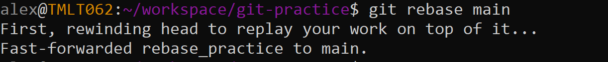

# Rebase

In this lesson you'll learrn
* What a git rebase is
* how to rebase
    * normal
    * interactive
* How to resolve conflicts when the arise

## What's a rebase?

At Trumid we practice trunk based developement. This means we want to drop new commits on top of master without needing to any sort of merge commit. Rebasing is a method for making sure we can do this by "catching up" your feature / development branch with any changes that have landed in master since you started development. Rebasing (instead of creating merge commits) offers a few benefits, including:
1. Producing clean diffs to master / main when you submit a PR on github
2. The ability to resolve conflicts (and test those resolutions) before merging your branch with master

If you were to visualized what's happening in a rebase, here's what it would look like. Before your rebrace, you may be a branch that looks like
```
          A---B---C branch
         /
D---E---F---G master
```
After rebasing branch onto master, it looks like:
```
              A'--B'--C' branch
             /
D---E---F---G master
```

## How can I rebase?

### Typical rebase experience

The most typical rebase experience consists of running these 4 commands
```
git checkout main          # checkout that main (or master) branch
git pull                   # pull down the latest changes on main from the remote github repo
git checkout <your_branch> # go back to your feature branch
git rebase                 # run a rebase
```

Try a typical rebase yourself!

1. make sure you have the latest version of main / master `git checkout main && git checkout master`
2. checkout a sample branch we've created for you `git checkout rebase_practice`
3. Take a look at what the git log looks like before you rebase

4. Now, rebase your branch onto the lates version of main: `git rebase main`. Your should see output that looks like this

5. Finally, take a look at what the git log of your branch looks like now. You'll see all your latest development commits coming after the latest commit to main.


### Resolving conflicts

Occassionaly, a change you've made in your branch will conflict with a change that already exists in master. When this happens git-rebase will alert you to the conflicts and you'll have the opportunity to manually resolve them. In this section, we'll walk you through that process.

1. make sure you have the latest version of main / master `git checkout main && git checkout master`
2. checkout a sample branch we've created for you `git checkout rebase_practice`
3. Add this change to the bottom of `world.py` and commit it. Take a look at your git log so far
```python
def spherical_to_cartesian(
    r: float,
    angle1: float,
    angle2: float,
) -> typing.Tuple[float, float, float]:
    
    x = r * math.sin(angle1) * math.cos(angle2)
    y = r * math.sin(angle1) * math.sin(angle2)
    z = r * math.cos(angle1)

    return (x, y, z)
```
The current git log


4. Run `git rebase main`. Notice that git is now reporting conflicts 

5. To resolve the conflicts go to the sections in your file labeled with `<<<<<<<` and `>>>>>>>`. Here, git is showing you two blocks of code. The first is the code as it exists in the current version of main (plus whatever commits you've already replayed on top of it). The second is the code that's coming in from your new commit. Choose which code you want to keep and which code you want to throw away. Then delete the git added annotations.

6. `git add world.py` and `git rebase` continue. Output should look like

7. Now to a look at your git log. Notices two things (a) your commit is at the top of master and (b) the commit has changed, since as part of the rebase process you modified what the commit was doing (step 5)


### Interactive rebase

Interactive rebase gives you a whole new power to rewrite your commit history and 


## Further Reading

* [Git Rebase Docs](https://git-scm.com/docs/git-rebase)
* [Squashing Commits](https://www.git-tower.com/learn/git/faq/git-squash)