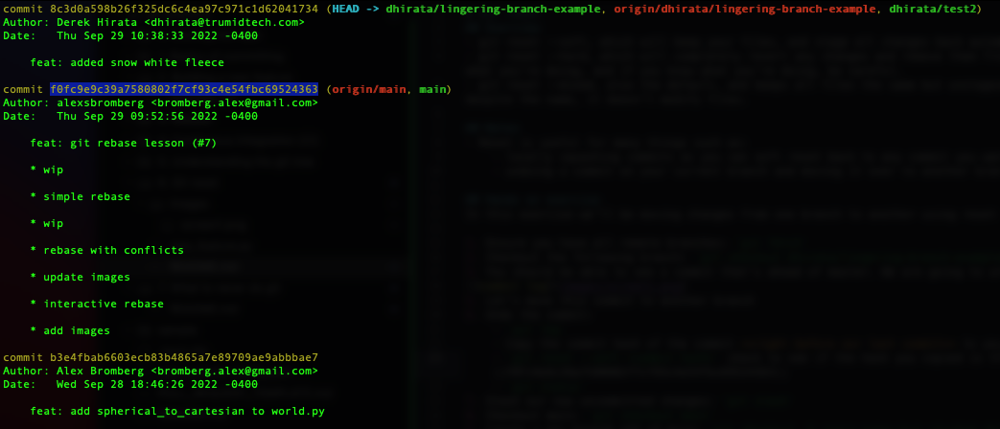

# Git reset
## Overview
- git reset --soft, which will keep your files, and stage all changes back automatically.
- git reset --hard, which will completely revert any changes and remove them from the local directory. Only use this if you know what you’re doing, and if you know what you're doing, be careful.
- git reset --mixed, also the default, and keeps all files the same but unstages the changes. This is the most flexible option, but despite the name, it doesn’t modify files.

## Notes
- Reset is useful for many things such as:
    - locally squashing commits as you can soft reset back to any commit you want and coalesce into a single commit.
    - undoing a commit on your current branch and moving it over to another branch via checkout

## Hands on exercise
In this exercise we'll be resetting a commit.

1. Ensure you have all remote branches: `git fetch`
2. Checkout the following branch: `git checkout dhirata/lingering-branch-example`
3. You should be able to see a commit that's ahead of master. We are going to undo this one.

4. Undo the commit:
    - `git log`
    - Copy the commit hash of the commit **right before our last commit** to your clipboard. It should be the highlighted commit in the previous screenshot
    - `git reset --soft <commit hash>` check to see if the hash you copied is the same as the example: ||f0fc9e9c39a7580802f7cf93c4e54fbc69524363||
    - `git status`
