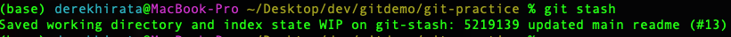
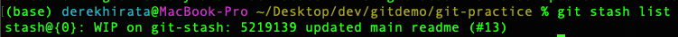
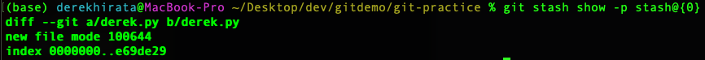

# Git stash
## Overview
The stash command lets you save uncommitted changes and reverts the working directory to the previous commit. Stashed changes are available to be retrieved from any branch in the repo.
## Common stash commands
### git stash
Quickest way to stash tracked changes. Changes will be unnamed in the stash.

### git stash save "some messsage"
You can name the stashed changes using a string. This is helpful when you want to give yourself a reminder what the changes are related to.

### git stash list
View what is in the stash

### git stash show -p <stash@some_number/name of stash>
View a diff of given stashed changes

### git stash pop
Applies the change to your working directory on the current checked out branch. **Also removes the stashed changes from the stash**. You can specify a name of the stashed changes you want to apply or it will do the most recent stashed changes (pop implies a stack datastructure).

### git stash apply
Applies the change to your working directory on the current checked out branch. **Does not remove the stashed changes from the stash**. You can specify a name of the stashed changes you want to apply or it will do the most recent stashed changes.

### git stash drop
Remove the most recent stashed change from the stash without applying it. You can also specify a name of the stashed change to be dropped.

### git stash clear
Clear the entire stash without applying any changes.

## Hands on exercise
In this exercise we'll be resetting a commit.

1. Make a fresh new branch off of master
2. Make a file: `touch example_file.py`
3. Run `git stash`. Why didn't the file get stashed?
4. Track the file by adding it: `git add example_file.py`
5. Run `git stash`. 
6. Look at the stash. 
7. Look at your working directory. `git status` it should be clean i.e. no file present anymore.
8. Check the diff of the stash against working directory: `git stash show -p stash@{0}` 
9. Run `git stash pop`
10. Check the status again: `git status`. You should see your file back in the working directory.
11. Try it with another file/change and this time name your stashed changes (see: `git stash save "some message"`).
